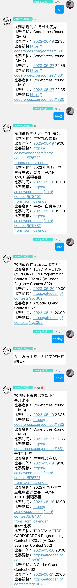

  
   
  

# nonebot-plugin-cp-broadcast

_✨ 一个 Codeforces、牛客竞赛、AtCoder 平台的编程竞赛查询插件，ACMer必备 ✨_

## 📖 介绍

对于每一个 ACMer 来说，参加编程竞赛是必不可少的，这个插件实现了 Codeforces、牛客竞赛、AtCoder 这三个主流的编程竞赛平台的比赛查询和播报。

除了简单的指令外，它支持每天定时发送三种比赛的信息。

查询的结果会存到列表里，以减少网站爬取的次数。

由于 AtCoder 网站没提供比赛信息的 API，因此是直接对网页进行爬取的，代码中是爬取两个比赛，你可以自己修改得更多。

为什么取 cp-broadcast 这个英文名呢？因为竞赛性编程的英文是：Competitive Programming，直接拿来做名字感觉太长了，因此我把它写成了缩写，broadcast 是播报的意思，因此就用 cp-broadcast 来当名字了。

这是本蒟蒻的第一个上传至 pypi 的 nonebot2 项目，可能有很多不完善的地方，欢迎大家来提 issue 和 pull requests。 

有任何问题可联系QQ：3411907440。

## 💿 安装

使用 nb-cli 安装

在 nonebot2 项目的根目录下打开命令行, 输入以下指令即可安装

    nb plugin install nonebot-plugin-cp-broadcast

使用包管理器安装

在 nonebot2 项目的插件目录下, 打开命令行, 根据你使用的包管理器, 输入相应的安装命令

pip

    pip install nonebot-plugin-cp-broadcast

pdm

    pdm add nonebot-plugin-cp-broadcast

poetry

    poetry add nonebot-plugin-cp-broadcast

conda

    conda install nonebot-plugin-cp-broadcast

打开 nonebot2 项目根目录下的 `pyproject.toml` 文件, 在 `[tool.nonebot]` 部分追加写入

    plugins = ["nonebot_plugin_cp_broadcast"]

## ⚙️ 配置

在 nonebot2 项目的`.env`文件中添加下表中的必填配置

| 配置项 | 必填 | 默认值 | 说明 |
|:-----:|:----:|:----:|:----:|
| cp_broadcast_list | 否 | [ ] | 开启早晨自动播报今日比赛的群聊，填 QQ 群号，注意以字符串形式填入 |
| cp_broadcast_botname | 否 | "bot" | 填入你 bot 的名字，在 `help` 指令下会使用到你的 bot 的名字 |
| cp_broadcast_time | 否 | {"hour":"7", "minute":"20"} | 每日在群聊播报比赛信息的时间，默认是早上 7 点 20，你可以在配置文件中按默认值格式修改成你想要的时间 |
| cp_broadcast_updatetime | 否 | {"hour":"0", "minute":"0"} | 每天自动更新比赛数据的时间，默认是 0 点 0 分，你可以在配置文件中按默认值格式修改成你想要的时间 |

该插件依赖 [nonebot_plugin_apscheduler](https://github.com/nonebot/plugin-apscheduler) 实现定时发送功能，如果你是通过下载项目源码安装插件的话，请注意安装好依赖。

## 🎉 使用
### 指令表
| 指令 | 权限 | 需要@ | 范围 | 说明 |
|:-----:|:----:|:----:|:----:|:----:|
| `cf` | 群员 | 否 | 群聊 | 发送最近三场 Codeforces 比赛的信息 |
| `牛客` or `nc` | 群员 | 否 | 群聊 | 发送最近三场牛客比赛的信息 |
| `atc` | 群员 | 否 | 群聊 | 发送最近两场 AtCoder 比赛的信息 |
| `today` | 群员 | 否 | 群聊 | 发送今天的比赛信息 |
| `next` | 群员 | 否 | 群聊 | 发送今天后的部分比赛信息 |
| `help` | 群员 | 否 | 群聊 | 发送帮助信息 |
| `update` | 群员 | 否 | 群聊 | 手动更新比赛信息 |
### 效果图

